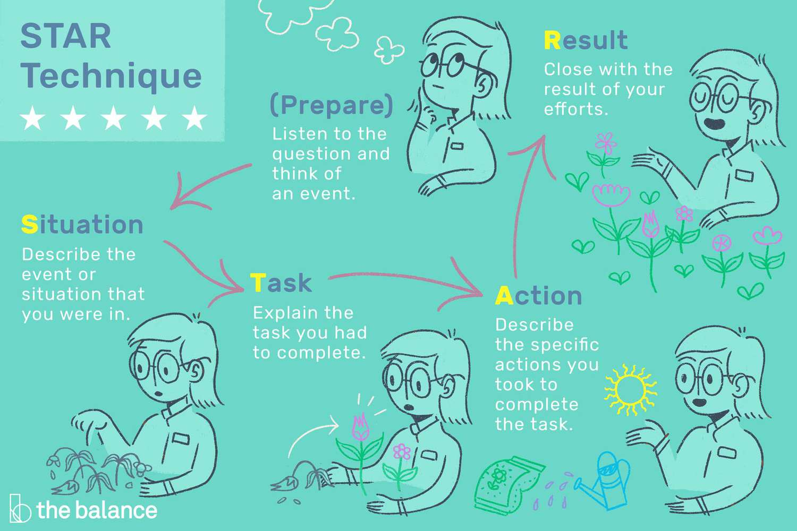

## :computer:Cyber Security Analyst Road Map:car:

#### 1. **Acquire industry-recognized certifications for Entry Level Cyber Security Analysts:**

   - [CompTIA Security+ (Free Study Materials)](https://www.linkedin.com/learning/topics/comptia?src=go-pa&trk=sem-ga_campid.11272822688_asid.110000966305_crid.470642844125_kw.comptia%20courses_d.c_tid.kwd-185271972_n.g_mt.p_geo.9028724&mcid=6841886150127296638&cid=&gclid=CjwKCAjw04yjBhApEiwAJcvNoYq9OAD2WiB4h4E1f-hx2gsP4Zlbjnhocwg0Mga76FU-faqi_wqQJRoCZD4QAvD_BwE&gclsrc=aw.ds)
   - [Cybrary Certified Professional (CCP)](https://click.linksynergy.com/deeplink?id=JVFxdTr9V80&mid=39197&murl=https%3A%2F%2Fwww.udemy.com%2Fcourse%2Ffree-aws-certified-cloud-practitioner%2F)
   - [Google IT Support Professional Certificate (Coursera)](https://grow.google/certificates/it-support/?utm_source=google&utm_medium=paidsearch&utm_campaign=ha-sem-bk-it-exa__geo--US&utm_term=google%20it%20support%20professional%20certificate&gad=1&gclid=CjwKCAjw04yjBhApEiwAJcvNoaarFQQF7CPf3XTYsSPL4w-BnrzIjBDDvw0VZcm20YnhIqjyiG_d_xoCurwQAvD_BwE#?modal_active=none)
   

#### 2. **Seek internships or project experience that could lead to an entry-level jobs in cybersecurity.**

  - [LinkedIn](https://www.linkedin.com/jobs) - LinkedIn is a professional networking platform that also offers a robust job board. It allows you to search for job openings, follow companies, and connect with professionals in your desired field.

  - [Indeed](https://www.indeed.com) - Indeed is one of the largest job search  platforms, featuring a wide range of job opportunities from various industries.

  - [Glassdoor](https://www.glassdoor.com) - Glassdoor provides not only job listings but also company reviews, salary information, and interview insights. This platform gives you a comprehensive view of potential employers.

 - [CareerBuilder](https://www.careerbuilder.com) - CareerBuilder offers a wide range of job opportunities, including entry-level positions suitable for early career students.

 - [Internships.com](https://www.internships.com) - Internships primarily focuses on internships, but it also lists entry-level jobs suitable for students and recent graduates.

#### 3. **Continual learning through online courses, workshops, conferences, and industry publications.**

 - [Cybrary](https://www.cybrary.it) - Cybrary offers a wide range of free and affordable cybersecurity courses, covering various topics such as network security, ethical hacking, and incident response.

 -  [Udemy](https://www.udemy.com) - Udemy is an online learning platform that offers affordable courses on cybersecurity. Look for courses taught by experienced instructors and with high ratings and reviews.

 - [Coursera](https://www.coursera.org) - Coursera partners with top universities and institutions to provide online courses on cybersecurity. While some courses may require a fee, financial aid is often available for eligible students.

 - [LinkedIn Learning](https://www.linkedin.com/learning) - LinkedIn Learning offers a vast library of courses on cybersecurity, including practical hands-on training and guidance from industry experts. It provides a free trial period, and you can often access it through a LinkedIn Premium subscription.

 - [Pluralsight](https://www.pluralsight.com) - Pluralsight offers a subscription-based model, but it provides a free trial period. It offers a wide range of cybersecurity courses, allowing you to learn at your own pace and enhance your skills.

- [The Top Technology Publications And Blogs To Read](https://www.relevance.com/tech-publications/):bulb:

_**Remember to read course descriptions, reviews, and ratings before enrolling in any online course. Look for courses that align with the specific tech certifications you are targeting for your entry-level job in cybersecurity. Additionally, check for any discounts or promotions that might be available on these platforms to make the courses even more affordable._**

 

#### 4.**Attend cybersecurity conferences, join professional organizations, and connect with industry experts for networking and professional development.**
 

-  **Cybersecurity Meetups and Communities**:
   - [Meetup](https://www.meetup.com) - Search for local cybersecurity meetups in your area. Meetup is a platform that connects people with common interests, and you can find cybersecurity-related events, workshops, and networking opportunities.
   - [Reddit](https://www.reddit.com/r/cybersecurity) - Join cybersecurity-related subreddits to engage in discussions, ask questions, and connect with professionals in the field. Look for local subreddits or those specific to your areas of interest.

- **High School Clubs and Competitions**:
   - Check if your high school has a cybersecurity club or technology-focused organizations that host competitions or events. Participating in these activities will allow you to meet like-minded individuals and potentially network with professionals who support or sponsor these initiatives.

- **Virtual Conferences and Webinars**:
   - [Black Hat](https://www.blackhat.com) - Black Hat is one of the most well-known cybersecurity conferences that focuses on the latest trends, research, and techniques in the industry. They offer virtual events, webinars, and training sessions that you can attend remotely.
   - [Defcon](https://www.defcon.org) - Defcon is another popular cybersecurity conference that covers a wide range of topics. They also provide virtual sessions and workshops that you can participate in from anywhere.

- **Online Communities and Forums**:
   - [Cybrary Community](https://www.cybrary.it/community) - Cybrary has an active community forum where you can connect with other cybersecurity enthusiasts, ask questions, and share knowledge.
   - [Hack The Box](https://www.hackthebox.eu) - Hack The Box is an online platform that offers hands-on cybersecurity challenges and training. They have an active community where you can engage with other members and learn from experienced professionals.

Remember to check the websites and platforms regularly for updates on upcoming events, conferences, and networking opportunities. Additionally, consider reaching out to local universities or cybersecurity organizations to inquire about any youth-focused events or programs they might offer.

 

#### 5. **Consider specializing in a specific area of cybersecurity, such as network security, incident response, or penetration testing.**

:lock: **Network Security**:shield:: Network security is like being a digital guardian for computer systems and networks. Imagine yourself as a cyber superhero protecting valuable information and preventing bad guys from sneaking into networks. You'll learn how to set up firewalls, detect and stop malicious activities, and make sure data travels safely across the internet. It's all about keeping the digital world safe and secure!

:mag: **Incident Response**:detective:: Ever watched detective movies where experts analyze clues and solve mysteries? Incident response is just like that, but in the digital world. You'll become a cyber investigator, ready to jump into action when a security breach occurs. Your role will be to identify and analyze cyber threats, respond quickly to minimize damage, and gather evidence to catch the bad guys. It's an exciting mix of problem-solving, critical thinking, and working under pressure.

:key: **Penetration Testing**:bug:: Penetration testing is like being a digital spy, but on the good side. You'll be authorized to hack into computer systems and networks to find vulnerabilities before the bad guys do. It's all about thinking like a hacker and using your skills to break into systems, but with the goal of helping organizations strengthen their security defenses. You'll learn cool techniques, use cutting-edge tools, and uncover weaknesses that could be exploited by real attackers. It's like being a secret agent in the cyber world!

_Remember, each area has its unique challenges and opportunities. Exploring these specializations will allow you to dive deeper into specific aspects of cybersecurity and develop expertise that can set you apart in the field._
 

#### 6. **Engage in mock interviews and resume-building activities to develop skills for presenting yourself confidently to potential employers.**
 

   **During mock interviews, you can practice using the STAR:star: method to effectively answer behavioral interview questions.**
   
    
   - **Situation**: Describe the specific situation or context in which the experience occurred.
   - **Task:** Explain the task or goal you were working towards in that situation.
   - **Action:** Share the actions you took to address the situation or accomplish the task.
   - **Result:** Discuss the outcome or results of your actions and any lessons learned.
  
By using the STAR method, you can provide structured and detailed responses that showcase your skills and experiences to potential employers. Practicing this method can help you feel more prepared and confident during actual job interviews.
 

#### Resume Building Resources:
- [Novoresume](https://novoresume.com/): Novoresume is a simple-to-use resume builder that offers a range of templates, designs, and customization options. It also has a section with tips and advice on how to write an effective resume.

- [Resume.com](https://www.resume.com/) offers an intuitive, step-by-step resume builder that guides users through the process of creating a professional-looking resume. It also offers a library of resume examples, cover letter templates, and job search advice.

 - [Canva](https://www.canva.com/resume-templates/): Canva is a design platform that offers a variety of free resume templates that are easy to customize with drag-and-drop functionality. It also offers a library of graphics and icons that can be used to enhance your resume's visual appeal.

### :milky_way:Remember, this Road Map is a general guide for entry level job seekers, and it's important to adapt and remain flexible based on personal interests and opportunities that arise along the way :satellite: